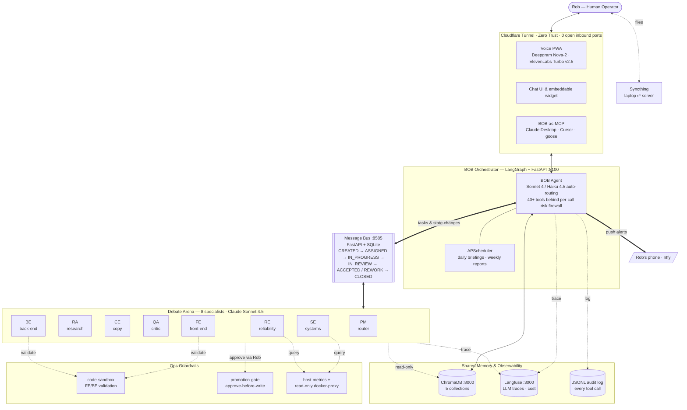

# Don Quixote — Self-Hosted Multi-Agent AI Platform

> **A production-grade multi-agent orchestrator running on bare-metal Ubuntu. One operator. Sixteen containers. Human-in-the-loop by design.**

Don Quixote is the name of the physical server. The software running on it is a coordinated team of AI agents built around **BOB the Skull** — a LangGraph orchestrator with 40+ tools — and a debate-arena of specialist agents that critique and refine each other's work through an explicit task state machine on a custom message bus.

This is not a weekend demo. The platform has been running continuously for 28+ days, mediates real business workflows (email triage, research, copywriting, infrastructure planning, front-end and back-end development), speaks in both text and real-time voice, and pushes back when the human is wrong.

---

## Why This Exists

Generic multi-agent frameworks (AutoGen, CrewAI, off-the-shelf LangGraph tutorials) demonstrate the shape of agent collaboration but stop short of production. They leave out the things that matter when a system runs unattended for weeks: persistent memory, task state discipline, tool-level risk gates, observability, secure remote access, rate limiting, cost tracking, and graceful recovery from partial outages.

This repo is the answer to a simple question: *what does it actually take to run a multi-agent team as critical personal infrastructure?* Every component exists because a prototype failed without it.

---

## At a Glance

| Dimension | Figure |
| --- | --- |
| Hardware | Dell OptiPlex 5050, 32 GB RAM, Ubuntu 24.04 |
| Continuous uptime | 28+ days |
| System load (avg) | ~0.12 |
| Memory footprint | ~9% of 32 GB |
| Docker containers | 16 |
| Registered AI agents | 9 on the message bus (BOB + 8 debate-arena specialists) |
| BOB native tools | 40+, all behind a per-call risk firewall |
| Debate tiers | 4 (`no_debate` → `light_review` → `critique_revise` → `full_tension`) |
| Max critique-and-refine rounds | 5 (campaign tier) |
| Shared memory collections | 5 (brand_voice, decisions, research, product_specs, project_context) |
| Observability | Every LLM call traced in Langfuse (tokens, cost, latency, full I/O) |
| Exposed public ports | 0 — everything reachable via outbound-only Cloudflare Tunnel |
| Voice stack | MediaRecorder → WebSocket → Deepgram Nova-2 → LLM → ElevenLabs Turbo v2.5 |
| Idle polling reduction | ~60% (115K → 46K API calls/day after adaptive-polling rollout) |

---

## System Diagram



---

## Architecture

The platform is organized around four cooperating substrates: an orchestrator that talks to the human, a debate arena that does the work, a message bus that keeps everyone on the same page, and a vector-memory store that preserves shared context across sessions and agents.

### 1. BOB — The Orchestrator

BOB is a [LangGraph](https://github.com/langchain-ai/langgraph) ReAct agent running in a FastAPI container ([bob-orchestrator/](bob-orchestrator/)). He is the primary interface: Rob talks, BOB decides what to handle directly versus what to delegate to the specialist team.

- **Model:** Claude Sonnet 4 (heavy tier, default) with automatic routing to Claude Haiku 4.5 for simple requests — see [app/router.py](bob-orchestrator/app/router.py). Ollama and OpenAI are supported as drop-in providers via the adapter in [app/llm.py](bob-orchestrator/app/llm.py).
- **Personality:** swappable at runtime via [app/personality.py](bob-orchestrator/app/personality.py) (`sardonic`, `neutral`, `terse`, or custom). The default is modeled on Bob the Skull from Jim Butcher's *Dresden Files* — encyclopedic, sardonic, never flattering.
- **Tools:** 40+ native tools in [app/tools.py](bob-orchestrator/app/tools.py) covering the message bus, Gmail, Google Maps, photo intake, scheduled jobs, memory, push notifications, system health, voice-usage monitoring, file-promotion approvals, and personality switching — plus any MCP tool fetched from the servers listed in [mcp_servers.json](bob-orchestrator/mcp_servers.example.json).
- **Persistent thread history:** LangGraph `AsyncSqliteSaver` checkpointer — Rob can resume a conversation after a restart or on a different device and BOB remembers.
- **MCP everywhere:** BOB is both an MCP *client* (loads external tools at startup from [app/mcp_client.py](bob-orchestrator/app/mcp_client.py)) and an MCP *server* (exposes its own high-level capabilities to Claude Desktop, Cursor, goose, etc. via [app/mcp_server.py](bob-orchestrator/app/mcp_server.py)).

### 2. The Debate Arena

The [debate-arena/](debate-arena/) stack is the "Business Operations team" — a tiered, task-typed committee of specialist agents that produce, critique, and refine work before anything reaches Rob.

Eight agents are live in [docker-compose.yml](debate-arena/docker-compose.yml):

| Shorthand | Role | Port |
| --- | --- | --- |
| PM | Project manager — classifies tasks, assigns primary agents and critics, handles escalation | 8101 |
| RA | Researcher — market data, competitor analysis, live web search | 8102 |
| CE | Copy editor — long-form content, brand voice enforcement | 8103 |
| QA | Quality assurance — adversarial reviewer, final critic | 8104 |
| SE | Systems engineer — deployment plans, Docker, infrastructure architecture | 8105 |
| RE | Reliability engineer — on-call thinking, risk, ops | 8106 |
| FE | Front-end engineer — HTML/CSS/JS, static sites, UI work | 8107 |
| BE | Back-end engineer — APIs, services, agent containers, schemas | 8109 |

All agents run **Claude Sonnet 4.5**. Two more agent scaffolds (`graphic-artist`, `web-designer`) exist in [agents/](debate-arena/agents/) and are wired into the routing taxonomy but not yet containerized.

**Tiered debate:** PM classifies every incoming task into one of nine task types (`campaign`, `content`, `visual`, `research`, `seo`, `infrastructure`, `frontend_dev`, `backend_dev`, `simple`) using a keyword classifier with a Haiku fallback for ambiguous cases. Each type maps to a debate tier in [common/buslib/buslib/debate.py](debate-arena/common/buslib/buslib/debate.py):

- **`no_debate`** — single-shot response, no critics (trivial lookups).
- **`light_review`** — one critique pass (SEO, meta tags).
- **`critique_revise`** — up to 3 rounds with an adversarial QA gate (research, visual, infrastructure, frontend, backend).
- **`full_tension`** — up to 5 rounds with all critics active (campaigns, long-form content).

Critics are role-based (see `CRITIC_ASSIGNMENTS` in the same file): RA is critiqued by CE and QA; BE is critiqued by FE, SE, and RE. The final critic depends on task type — QA for creative work, RE for anything that touches infrastructure or production code.

**Ops discipline:**

- [services/code-sandbox/](debate-arena/services/code-sandbox/) — sandboxed code execution container that FE/BE use to validate generated code before promotion.
- [services/promotion-gate/](debate-arena/services/promotion-gate/) — approval workflow for file promotions (agent-generated files never land in live targets without Rob's explicit approve/reject).
- [services/host-metrics/](debate-arena/services/host-metrics/) — psutil-based host telemetry, fed by a read-only docker-socket proxy so SE and RE can reason about the actual server state.

### 3. Message Bus — Nervous System

Custom FastAPI + SQLite service at [message-bus/](message-bus/) (port 8585). Not Redis, not RabbitMQ, not Kafka — none of those encode the concepts that matter here (task state, per-message ack, topic subscriptions, capability registry). The bus is ~700 lines of Python with a Jinja-rendered real-time dashboard at `/`.

**Task state machine** — the spine of all agent coordination ([app/models.py](message-bus/app/models.py)):

```text
    CREATED  ──► ASSIGNED  ──► IN_PROGRESS  ──► IN_REVIEW
                    ▲                                │
                    │                                ├──► ACCEPTED ──► CLOSED
                    │                                │
                    └──────  REWORK  ◄───────────────┘
```

Transitions are enforced server-side by `VALID_TRANSITIONS` — an agent cannot jump a task from `CREATED` straight to `ACCEPTED`. This is mundane until a hallucinating agent tries to do exactly that at 2 AM.

**Primitives:** agents register themselves and their capabilities, subscribe to topics (`escalation`, `task:completed`, `task:failed`, `health:alert`, `daily:report`), post typed messages (`task_assignment`, `status_update`, `deliverable`, `feedback`, `question`, `escalation`, `state_change`), and acknowledge receipt with explicit `received` / `read` / `acted` statuses.

**Real-time fan-out:** state changes are broadcast over a WebSocket so the live dashboard and any subscribing agent sees updates without polling (adaptive polling is still used as the coordination model; the WebSocket eliminates dashboard latency).

### 4. Shared Memory — ChromaDB

One ChromaDB container shared across the whole platform ([bob-orchestrator/docker-compose.yml](bob-orchestrator/docker-compose.yml)). Five collections, each with a defined purpose ([app/memory.py](bob-orchestrator/app/memory.py)):

| Collection | Contents |
| --- | --- |
| `brand_voice` | ATG brand guidelines, tone, color palette, messaging rules |
| `decisions` | Major decisions made by Rob, logged with date and context |
| `research` | Research findings from agents — market data, competitor analysis |
| `product_specs` | Product specifications, game design docs, feature lists |
| `project_context` | Active project briefs, status updates, blockers |

**Write discipline:** BOB is the sole writer. Debate-arena agents read through the allowlisted client in [common/buslib/memory.py](debate-arena/common/buslib/memory.py) and propose writes via [app/memory_proposals.py](bob-orchestrator/app/memory_proposals.py), which Rob or BOB approves before anything lands. Keeping the write surface narrow is the only thing that prevents a multi-agent system from poisoning its own context.

### 5. Observability

Every LLM call — BOB's and every debate-arena agent's — is captured by Langfuse via the LangChain callback handler ([app/graph.py](bob-orchestrator/app/graph.py)). Traces include full prompt/response, token counts, cost (resolved against the price table in [app/cost_tracker.py](bob-orchestrator/app/cost_tracker.py)), latency, and the tool-call tree. Langfuse runs on the same host and is reachable at the internal `:3000`.

On top of Langfuse traces, BOB writes a structured JSONL audit log for every tool call ([app/firewall.py](bob-orchestrator/app/firewall.py)) and emits push notifications via ntfy across four priority channels (`bob-critical`, `bob-reviews`, `bob-status`, `bob-daily`). A daily briefing and weekly competitor/SEO reports run through APScheduler with SQLite job persistence ([app/scheduler.py](bob-orchestrator/app/scheduler.py)) — the scheduler survives restarts without re-registering jobs.

### 6. Security

- **No inbound ports open to the internet.** Every public hostname (`bob.`, `voice.`, `bob-mcp.appalachiantoysgames.com`) is reached via an outbound-only Cloudflare Tunnel — see [cloudflared/config.yml](cloudflared/config.yml).
- **Cloudflare Zero Trust** enforces OIDC email-based access at the edge. The origin services never see unauthenticated traffic.
- **Per-tool risk firewall.** Every tool call — native *and* MCP-fetched — passes through [app/firewall.py](bob-orchestrator/app/firewall.py), which classifies tools as `LOW` (read-only, execute + quiet log), `MEDIUM` (write, recoverable, loud log), or `HIGH` (blocked pending explicit confirmation within 2 minutes via push notification).
- **Rate limiting** on the chat endpoint ([app/rate_limit.py](bob-orchestrator/app/rate_limit.py)) — 10 req/min, 60 req/hour per user.
- **Loop detector** ([app/loop_detector.py](bob-orchestrator/app/loop_detector.py)) — detects runaway tool-call cycles and halts the graph before it burns API budget.
- **Circuit breakers** ([app/circuit_breaker.py](bob-orchestrator/app/circuit_breaker.py)) — automatic backoff when an external service (Gmail, ElevenLabs, ntfy) starts failing.
- **Docker socket proxy** ([tecnativa/docker-socket-proxy](https://github.com/Tecnativa/docker-socket-proxy)) with only read endpoints allowlisted (POST/EXEC/DELETE/BUILD all blocked) — host-metrics reads container state without ever getting write access to the socket.
- **Audit log** — append-only JSONL at `bob-audit.jsonl` for every tool call, every firewall decision, every state change.

### 7. Voice

Real-time voice PWA at `voice.appalachiantoysgames.com`, served by [bob-voice-updates/](bob-voice-updates/):

```text
Browser (MediaRecorder)
   │  WebSocket (audio/webm;opus)
   ▼
BOB Voice Bridge (FastAPI)
   │  Deepgram Nova-2 live STT
   ▼
BOB Orchestrator (:8100) — chat endpoint, full tool access
   │  streamed text tokens
   ▼
ElevenLabs Turbo v2.5 TTS
   │  streamed MP3 chunks
   ▼
Browser (streaming audio playback)
```

The bridge ([app.py](bob-voice-updates/app.py)) caches TTS output by response hash (same sentence → one TTS bill) and maintains per-user voice conversation memory in a separate `voice_conversations` ChromaDB collection. Auth is handled by Cloudflare Zero Trust — the bridge reads the CF-authenticated email from request headers via [auth.py](bob-voice-updates/auth.py) and routes to per-user memory silos.

A chat-only version of the same integration is embedded as a drop-in JS widget ([bob-widget/bob-widget.js](bob-widget/bob-widget.js)) on the public ATG website.

---

## Container Inventory

Sixteen containers across four Compose projects:

**Root — [docker-compose.yml](docker-compose.yml)**

- `syncthing` — encrypted file sync between laptop and server for agent artifacts.

**Orchestrator — [bob-orchestrator/docker-compose.yml](bob-orchestrator/docker-compose.yml)**

- `atg-bob` — FastAPI + LangGraph orchestrator (chat, dashboard, MCP server) on :8100 / :8108.
- `chromadb` — shared vector memory on :8000.

**Message Bus — [message-bus/docker-compose.yml](message-bus/docker-compose.yml)**

- `message-bus` — task state machine + pub/sub + dashboard on :8585.

**Debate Arena — [debate-arena/docker-compose.yml](debate-arena/docker-compose.yml)**

```text
atg-pm                  (8101)  PM — task classifier and router
atg-researcher          (8102)  RA
atg-copy-editor         (8103)  CE
atg-qa                  (8104)  QA (final critic for creative work)
atg-sys-engineer        (8105)  SE — mounts read-only infra configs
atg-reliability-engineer(8106)  RE (final critic for infrastructure and code work)
atg-fe-engineer         (8107)  FE — mounts portfolio-site source
atg-be-engineer         (8109)  BE — mounts bob-orchestrator and debate-arena source
atg-code-sandbox                Isolated code execution for FE/BE validation
atg-docker-proxy                Read-only docker socket proxy
atg-host-metrics                Host telemetry (psutil over proxied socket)
atg-promotion-gate              Approval workflow for file promotions to live targets
```

All containers share an external `agent-net` Docker network so BOB, the bus, and the arena can address each other by service name without exposing ports outside the LAN.

Cloudflared runs alongside the stack via its own systemd unit using [cloudflared/config.yml](cloudflared/config.yml); Langfuse and ntfy run as separate deployments on the same host and are not versioned in this repo.

---

## What Makes This Different

Most multi-agent frameworks in the wild are tutorials or demos. This repo was designed — and hardened — for the case where **the operator has no team to catch their mistakes**, so the bar for production is higher than SaaS, not lower. Concretely:

- **A real task state machine, not a message queue.** `IN_REVIEW → REWORK → IN_PROGRESS` is a first-class concept on the bus; agents cannot short-circuit their way to `ACCEPTED`.
- **Tiered debate with role-aware critics.** Infrastructure tasks get RE as the final critic; campaigns get QA. The system understands that "good frontend work" is not graded the same way as "good ad copy."
- **Write-gated shared memory.** Agents read freely but must *propose* writes; BOB mediates. This is the only way multi-agent memory stays coherent over weeks.
- **Per-tool risk firewall.** Every tool call — including MCP tools fetched from external servers — is classified and either executed, logged loudly, or blocked pending a mobile confirmation. The firewall applies the same policy to a harmless `check_tasks` and a mutating `approve_promotion`.
- **Full observability from day one.** Langfuse traces plus JSONL audit logs plus ntfy push — there is no LLM call anywhere in the platform that goes un-recorded.
- **Secure public access with zero open ports.** Cloudflare Tunnel + Zero Trust (OIDC, email-allowlisted) means the server has *no* inbound listeners to the internet.
- **Real voice, not a demo toggle.** Streaming STT → streaming LLM → streaming TTS, with per-user memory and TTS caching. Sub-second time-to-first-audio on most requests.
- **Cost discipline.** Adaptive agent polling cut idle API calls by ~60% (from ~115K to ~46K per day). TTS responses are cached. Tavily search queries are deduplicated. ChromaDB client handles are cached across calls. Model tier routing sends simple requests to Haiku, reserving Sonnet for work that needs it.
- **Infrastructure-as-code migration path.** Helm chart at [bob-orchestrator/helm/](bob-orchestrator/helm/) is the prep work for an AWS/Kubernetes migration; the home-server prototype is not the end state, it is the proving ground.

---

## Running It Yourself

**Honest warning:** this repo is personal infrastructure. It assumes a specific hostname, a specific Cloudflare account, a specific Gmail account with OAuth credentials on disk, and a specific LAN IP (192.168.1.228). It is **not** currently packaged as a one-command deploy for strangers.

Two things are offered for anyone who wants to learn from the code:

1. **A narrowed-down quickstart** at [bob-orchestrator/quickstart/](bob-orchestrator/quickstart/) — brings up just BOB, ChromaDB, and two example MCP specialist agents. This is the smallest slice that demonstrates the orchestrator pattern.
2. **The full source as reference material.** Every Compose file is in-repo. Every environment variable is documented in [bob-orchestrator/app/config.py](bob-orchestrator/app/config.py). The task state machine, the debate tier logic, the firewall registry, the voice bridge — all are self-contained and readable.

If you want to stand up your own version:

```bash
git clone <this-repo> don-quixote
cd don-quixote

# Create the shared Docker network first — every compose project joins it.
docker network create agent-net

# Bring up the four stacks in dependency order.
docker compose -f message-bus/docker-compose.yml        up -d
docker compose -f bob-orchestrator/docker-compose.yml   up -d
docker compose -f debate-arena/docker-compose.yml       up -d
docker compose -f docker-compose.yml                    up -d   # syncthing

# Sanity checks.
curl http://localhost:8585/health     # message bus
curl http://localhost:8100/health     # BOB
curl http://localhost:8000/api/v1/heartbeat   # ChromaDB
```

You will need `.env` files for every stack (Anthropic key at minimum; Deepgram + ElevenLabs for voice; Gmail OAuth JSON for email monitoring; Cloudflare Tunnel credentials for public exposure). None of those secrets are checked into the repo — see [.gitignore](.gitignore).

---

## Repo Layout

```text
.
├── bob-orchestrator/         # BOB — LangGraph agent, FastAPI, 40+ tools, MCP, dashboard, Helm chart
│   ├── app/                  # Core agent code (graph, tools, firewall, router, memory, scheduler)
│   ├── bob_context/          # Personality files and context markdown fed into the system prompt
│   ├── dashboard/            # Vite + React operator dashboard
│   ├── eval/                 # Eval harness scaffolding
│   ├── helm/                 # Kubernetes chart (alpha — AWS migration prep)
│   └── quickstart/           # Narrow compose for first-time readers
├── debate-arena/             # 8 specialist agents + code sandbox + promotion gate + host metrics
│   ├── agents/               # Per-agent Dockerfiles, main.py, agent.py
│   ├── common/buslib/        # Shared client library (bus, memory, debate tier config)
│   └── services/             # code-sandbox, host-metrics, promotion-gate
├── message-bus/              # FastAPI + SQLite task state machine and pub/sub
├── bob-voice-updates/        # Voice PWA backend (WebSocket bridge, Deepgram, ElevenLabs)
├── bob-widget/               # Embeddable JS chat widget for external sites
├── atg-website-staging/      # Static ATG site staging area
├── cloudflared/              # Cloudflare Tunnel config (origin routing only — no secrets)
├── docker-compose.yml        # Root stack (Syncthing)
├── INFRASTRUCTURE.md         # Long-form operations documentation
├── IDEA_PARKING_LOT.md       # Parked future work
└── bob-*.md                  # Per-subsystem design documents (shared memory, firewall, voice, scheduler, etc.)
```

---

## About the Author

**Robert Colling** — AI infrastructure architect and Lead Analyst for Strategic Planning & Development at the **Veterans Health Administration**, with 8+ years engineering data infrastructure in one of the most complex healthcare environments in the country.

- USMC veteran, Counterintelligence / HUMINT (1998–2006)
- Lean Six Sigma Black Belt
- Currently building production AI infrastructure for a one-person operation the same way he builds for a federal enterprise — because the bar for reliability does not change when the team gets smaller

### Contact

- Email — [robert.colling@gmail.com](mailto:robert.colling@gmail.com)
- LinkedIn — [linkedin.com/in/robert-colling](https://www.linkedin.com/in/robert-colling)
- GitHub — [github.com/rscolling](https://github.com/rscolling)

---

## License

MIT — see [LICENSE](LICENSE). All first-party code in this repository is released under the same terms.
